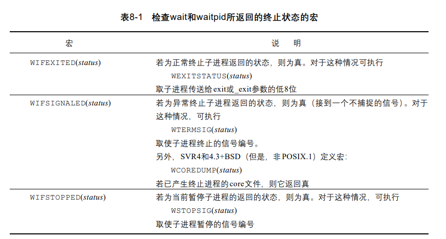
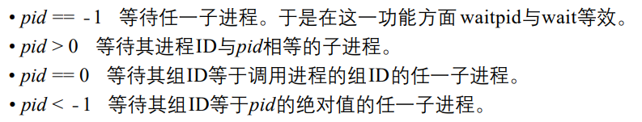
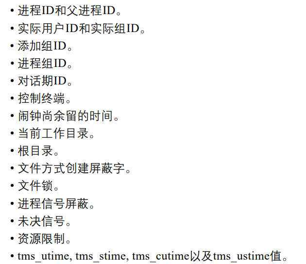
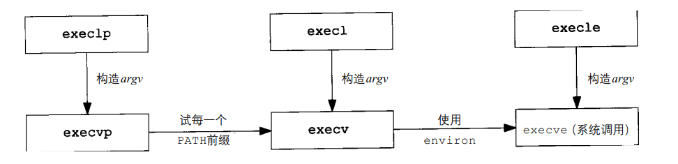
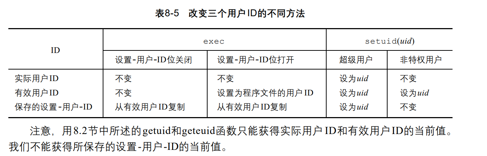

## 进程控制

### 6.1进程标识

UNIX系统中，每个进程都有一个唯一的非负整型ID来标识。系统中有一些专用的进程ID，例如：ID为0的进程是调度进程（或者叫交换进程），ID为1的进程是init进程（自举结束后用于初始化系统），ID为2的进程通常是守护进程。

`注意：init进程是普通的用于进程，但是以超级用户的特权执行。且是所有孤儿进程的父进程！` 

除了进程ID，每个进程还有其他的标识符，由下面这些函数返回。


### 6.2 fork函数

一个现存进程调用f o r k函数是U N I X内核创建一个新进程的唯一方法。

```c
#include <sys/types.h>
#include <unistd.h>
pid_t fork(void);
```

fork函数有两个返回值，在父进程中返回子进程的pid，在子进程中返回0。

子进程会拷贝父进程的数据空间、堆、栈。对于正文段，若正文段是只读的，则会父子进程共享。

`注意：在有些实现方式中，对父进程的数据段和堆部分并不会完全拷贝。而是写时拷贝（Copy on Write）。`

创建子进程后，父子进程谁先执行是不确定的，主要看内核的调度算法。

#### 6.2.1 父子进程之间的文件共享

子进程会复制父进程的文件打开表，因此父子进程的文件打开表中相同的文件描述符指向内核文件表中的同一个表项，共享文件偏移量。


**fork失败的两种原因**

* 系统中已经有了太多的进程

* 该实际用户ID所拥有的进程数超过了系统限制

**fork的两种用法**

* 一个父进程希望复制自己，使父、子进程同时执行不同的代码段。这在网络服务进程
  中是常见的——父进程等待委托者的服务请求。当这种请求到达时，父进程调用 f o r k，使子进程处理此请求。父进程则继续等待下一个服务请求。

* 一个进程要执行一个不同的程序。这对shell是常见的情况。在这种情况下，子进程在
  从fork返回后立即调用exec

#### ~~6.2.2 vfork函数~~

也是用于创建一个新进程。但是此新进程的目的是未来exec一个新程序。比如shell就是这类程序的一个例子。

**和fork的区别**

* vfork不会完全复制父进程的地址空间

* vfork保证子进程先运行，只有子进程调用了exec或者exit时，父进程才会恢复执行。

* 若是在子进程中修改数据、进行函数调用、没有exec或者exit就返回可能会造成未知后果

`注意：此函数已经废弃了，尽量别使用`

### 6.3 exit函数

此函数用于控制进程的终止。进程有5种正常终止的方法和3种异常终止的方法，正常终止的方法就是return 0、exit、_exit、pthread_exit等等方法。异常终止方法如下

* 调用abort，它产生SIGABRT信号

* 当进程收到某些信号时。信号可由进程本身、其他进程或者内核产生。如前面调用abort就是产生SIGABRT信号。

* 最后一个线程对取消（cancellation）请求做出响应

不管进程如何终止，最后都会执行内核中的一段代码，这段代码为相应进程关闭所有打开的文件描述符并释放它使用的存储器。

#### 6.3.1 孤儿进程

我们希望进程终止时应该向父进程告诉它是如何终止的，exit函数就是通过传入终止状态来报告的。而若是父进程比子进程更早终止，那么子进程就变成孤儿进程，内核会把孤儿进程的父进程设置为init进程。流程如下：

> 当有一个进程终止时，内核会轮流检查所有正在活动的进程，判断是不是刚刚终止进程的子进程，若是，则内核会把他们的父进程的PID设置为1（init进程的PID）。

#### 6.3.2 僵死进程

指某些进程在终止后，父进程没有对其进行善后处理（获取终止子进程相关信息、释放它`仍然占用的资源`）。这些进程就叫做僵死进程。

**分析：进程终止后，文件描述符和占用的内存应该是由内核来回收的，但是为什么需要父进程来进行善后处理呢？**

> 因为在子进程终止后，虽然资源释放回收的工作是由内核来做的，但是内核为了父进程能够获取到子进程的终止状态，会为子进程在内存保留一定量的信息（进程ID、终止状态、使用CPU的时间），以便于父进程调用wait和waitpid时获取到它。因此，若是父进程没有调用wait或者waitpid去获取这部分信息，那么它这部分信息就无法释放会一直留在内存，直至父进程也终止，才会被父进程的父进程即bash进程释放掉。

### 6.4 wait和waitpid函数

当一个进程终止时，内核会向其父进程发送SIGCHLD信号。对于此信号，父进程可以忽略它也可以提供一个处理该信号的函数。系统默认行为是忽略此信号。虽然这个信号和wait函数没啥关系，但是wait和waitpid是阻塞的，因此，若是在捕获到SIGHCLD信号时调用wait和waitpid的话，就可以避免阻塞。

```c
#include <sys/types.h>
#include <sys/wait.h>
pid_t wait(int *wstatus);
pid_t waitpid(pid_t pid, int *wstatus, int options);
```

**wait和waitpid的区别**

* 在一个子进程终止前， wait 使其调用者阻塞，而 waitpid 有一选择项，可使调用者不阻塞。

* waitpid并不等待第一个终止的子进程—它有若干个选择项，可以控制它所等待的进程。

**参数解析**

* wstatus保存进程的终止状态，若不关心终止状态，则可设为NULL，可以用如下三个宏函数来检查终止状态
  
  > 

* pid指waitpid所等待的进程的id，根据pid的值不同，可以分为如下几种情况。



* option的值可以由如下几种情况。
  
  * 0：和wait一样，没回收到进程则阻塞
  
  * WNOHANG：若没回收到进程，则不阻塞，返回0
  
  * WUNTRACE：如果pid指定的子进程暂停了，则立即返回，并且不跟踪子进程的状态

`一个避免僵死进程的小技巧`

> 由于内核会把孤儿进程的父进程设置为init进程，init进程可以帮我们管理子进程的回收，因此，我们可以先fork一个子进程，然后再用这个子进程fork第二个子进程，然后第一个子进程退出，这样第二个子进程就成了孤儿，因此内核会把它的父进程设置成init进程。这样一来，我们就不用在父进程里担心子进程僵死了。

### 6.5 wait3和wait4函数

对应wait和waitpid函数的升级版，会要求内核返回终止进程所使用的资源摘要。原型如下。

```c
#include <sys/types.h>
#include <sys/time.h>
#include <sys/resource.h>
#include <sys/wait.h>
pid_t wait3(int *wstatus, int options,
                   struct rusage *rusage);
pid_t wait4(pid_t pid, int *wstatus, int options,
                   struct rusage *rusage);
```

### 6.6 exec函数

exec函数的功能是用另一个程序替换正在运行的程序，当进程调用一种exec函数时，该进程完全由新程序代换，而新程序则从其main函数开始执行。因为调用exec并不创建新进程，所以前后的进程ID并未改变。exec只是用另一个新程序替换了当前进程的正文、数据、堆和栈段。

**exec函数族由以下六个**

```c
#include <unistd.h>
extern char **environ;
int execl(const char *pathname, const char *arg, ...
                       /* (char  *) NULL */);
int execlp(const char *file, const char *arg, ...
                       /* (char  *) NULL */);
int execle(const char *pathname, const char *arg, ...
                       /*, (char *) NULL, char *const envp[] */);
int execv(const char *pathname, char *const argv[]);
int execvp(const char *file, char *const argv[]);
int execvpe(const char *file, char *const argv[],
                       char *const envp[]);
```

**函数说明**

* 第一个参数为file的表示可以传入文件名，然后会在环境变量PATH的路径下找文件名对应的可执行文件。pathname表示必须传入路径。

* l表示list，v表示vector。因此execl、execlp、execle表示传入的可执行文件的参数arg必须以参数列表的形式传入，并且最后要以一个NULL结尾，如：```execl("/home/a.out", "cyd", "24", "male", NULL);```。而execv、execvp、execvpe表示传入的参数必须以指针数组的形式传入。即我们先把可执行文件的参数存在一个指针数组里，再把这个指针数组传入进去。

* e表示环境表，因此execle和execvpe都可以传入一张环境表。这个环境表即给新进程指定的环境表

执行新程序后，下面这些变量仍然保持不变。



<font color = "red">**注意：**</font>

> 若进程由超级用户特权，则在exec前要改回普通用户权限

exec执行的新进程对于原进程打开的文件的处理则与文件的FD_CLOEXEC标志有关。若是设置了这个标志，则exec的新进程会关闭原进程已打开的文件。默认文件的FD_CLOEXEC标志没有设置。

这六个函数中只有execve是系统调用，其他都是库函数，关系如下。



### 6.7 更改用户ID和组ID

setuid和setgid函数原型如下

```c
#include <sys/types.h>
#include <unistd.h>
int setgid(gid_t gid);
int setuid(uid_t uid);
```

通过这两个函数可以设置进程的组ID和用户ID。关于设置的是有效用户ID还是实际用户ID，分为以下两种情况

* 若进程具有超级用户特权，则会将uid设置成进程的实际用户ID、有效用户ID、设置用户ID。

* 若进程没有超级用户特权，但是uid等于实际用户ID或者设置用户ID，则会将uid设置成进程的有效用户ID。

* 若上述两个条件都不满足，则errno设置成EPERM，并返回出错

`注意:对于组ID的设置规则也一样`

**exec也会可能会改变进程的用户ID**



获取进程的实际用户ID和有效用户ID

```c
#include <unistd.h>
#include <sys/types.h>
uid_t getuid(void);
uid_t geteuid(void);
```

交换实际用户ID和有效用户ID的值，可以用setreuid和setregid

```c
#include <sys/types.h>
#include <unistd.h>
int setreuid(uid_t ruid, uid_t euid);
int setregid(gid_t rgid, gid_t egid);
```

`注意：非特权用户也可以使用这两个函数`

### system函数

system函数可以用shell执行我们想要执行的命令，原型如下

```c
#include <stdlib.h>
int system(const char *command);
```

因为system在其实现中调用了fork、exec和waitpid，因此有三种返回值：

* 如果fork失败或者waitpid返回除EINTR之外的出错，则system返回－1，而且errno中设置了错误类型。

* 如果exec失败(表示不能执行shell )，则其返回值如同shell执行了exit( 127 )一样。

* 否则所有三个函数(fork、exec和waitpid)都成功，并且system的返回值是shell的终止状态，其格式已在w a i t p i d中说明。

**system的实现如下**

```c
int system(const char * command){
    pid_t pid;
    int status;
    if(command == NULL){
        return 1;
    }
    if((pid = fork())==-1){
        perror("fork error");
        exit(-1);
    }
    else if (pid == 0){
        //子进程
        execl("/bin/sh",  "-c", command, NULL);
        exit(127);
    }
    //父进程，用于回收
    while(waitpid(pid, &status, 0) == -1){
        if(errno != EINTR){
            //不是被信号打断，说明是真的出错了
            status = -1;
            break;
        }
    }
    return status;
}
```

<font color = "red">**特别注意**</font>

> 若调用system的进程有超级用户特权的话，则system执行的程序会继承调用system的进程的超级用户权限，这是一个`漏洞`，因此，禁止在有超级用户特权的进程中调用system函数。

### 5.10 进程会计

大多数UNIX系统提供了一个选项进行进程会计处理，启用了该选项后，每当进程结束时内核就写一个会计记录。这个记录包含了进程的生命周期的一些信息。结构如下

```c
#define ACCT_COMM 16

typedef u_int16_t comp_t;

struct acct {
    char ac_flag;           /* Accounting flags */
    u_int16_t ac_uid;       /* Accounting user ID */
    u_int16_t ac_gid;       /* Accounting group ID */
    u_int16_t ac_tty;       /* Controlling terminal */
    u_int32_t ac_btime;     /* Process creation time
                                          (seconds since the Epoch) */
    comp_t    ac_utime;     /* User CPU time */
    comp_t    ac_stime;     /* System CPU time */
    comp_t    ac_etime;     /* Elapsed time */
    comp_t    ac_mem;       /* Average memory usage (kB) */
    comp_t    ac_io;        /* Characters transferred (unused) */
    comp_t    ac_rw;        /* Blocks read or written (unused) */
    comp_t    ac_minflt;    /* Minor page faults */
    comp_t    ac_majflt;    /* Major page faults */
    comp_t    ac_swaps;     /* Number of swaps (unused) */
    u_int32_t ac_exitcode;  /* Process termination status
                                          (see wait(2)) */
    char      ac_comm[ACCT_COMM+1];
                                       /* Command name (basename of last
                                          executed command; null-terminated) */
    char      ac_pad[X];    /* padding bytes */
};

enum {          /* Bits that may be set in ac_flag field */
    AFORK = 0x01,           /* Has executed fork, but no exec */
    ASU   = 0x02,           /* Used superuser privileges */
    ACORE = 0x08,           /* Dumped core */
    AXSIG = 0x10            /* Killed by a signal */
};
```

`注意：其中各个字段的功能含义就不细说了，可以查看UNIX环境高级编程一书`

启用或者禁用进程会计通过函数acct。记录到指定的文件中。

```c
#include <unistd.h>
int acct(const char *filename);
```

但是acct函数在ubuntu系统上并未实现，而且很少用，所以就不细说了。

### 5.11 用户标识

每个进程都有实际用户ID、有效用户ID和组ID。有的时候，我们想要获取开启该进程的终端的登陆用户名。可以调用getlogin函数

```c
#include <unistd.h>
char *getlogin(void);
```

当然也可以通过getpwuid和getuid或者geteuid结合来获取实际(有效)用户对应的用户口令信息。

### 5.12 进程调度

内核为每个进程都设置了一个优先级（nice）来作为进程调度的依据。宏`NZERO`是每个进程的系统默认优先级，若是不知道`NZERO`在哪个头文件中，也可以用宏sysconf参数`_SC_NZERO`来获取默认优先级，用法为·sysconf(_SC_NZERO)·。可以nice函数来修改本进程的优先级，一般nice值越小，优先级越高。

```c
int nice(int inc);
```

inc是我们设置的优先级。若成功返回新的nice值。若是出错则返回-1并设置errno。

inc太大，会自动把它设置成所允许的最大nice值，inc太小。则会自动把它设置成所允许的最小nice值。

`特别注意：-1也可能是成功的返回值，因此要结合errno来判断。只有返回值为-1且errno非0时，才说明出错`

但是更建议使用以下两个函数来设置获取优先级。因为能设置一组进程的优先级。

```c
#include <sys/time.h>
#include <sys/resource.h>
int getpriority(int which, id_t who);
int setpriority(int which, id_t who, int prio);
```

which取以下三个值，控制who参数时如何解释的。

* which取PRIO_PROCESS，表示进程

* which取PRIO_PGRP，表示进程组

* which取PRIO_USER，表示用户ID

`注意：可以通过宏PRIO_MIN和PRIO_MAX来获取优先级值的范围，在ubuntu上，为-20到19。`

如果which作用于多个进程，则getpriority返回所有进程优先级最高的（最小的nice值）。

who为进程、进程组或者用户ID的值。如果为0。则表示调用的进程、进程组或调用进程的实际用户ID的值。

### 5.13 进程时间

计算机中有三个时间。墙上时钟时间、用户CPU时间、系统CPU时间。任意进程都可以调用times函数来获取它自己以及终止子进程的上述值。times函数原型如下。

```c
#include <sys/times.h>
clock_t times(struct tms *buf);
```

返回值，为墙上时钟时间。而结构体buf中则存储了用户CPU时间和系统CPU时间。tms结构体如下。

> 特别注意，墙上时钟时间为滴答数，并不是秒数，需要通过_SC_CLK_TCK（由sysconf函数返回的每秒时钟的滴答数）来转换成秒数。`sysconf(_SC_CLK_TCK_)`

```c
struct tms {
    clock_t tms_utime;  /* user time */
    clock_t tms_stime;  /* system time */
    clock_t tms_cutime; /* user time of children */
    clock_t tms_cstime; /* system time of children */
};
```

`注意：可以通过程序结束时的墙上时钟减去程序开始时的墙上时钟来计算程序运行时间。`
