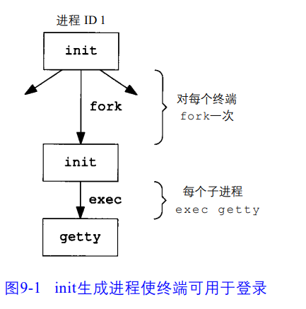

## 进程控制

### 7.1 终端登陆

1. **打开终端**

在启动系统后，init程序会读取`/etc/ttys`文件，ttys文件里面每一行都记录了一个终端设备的设备名和传入到getty程序的参数。然后init程序对每一个允许登陆的终端设备，都会fork一个子进程，然后子进程会调用exec函数执行`getty程序`。getty程序则会对相应的终端调用open函数，以读、写的方式将终端打开。

**流程图如下所示**



2. **登陆**

getty对终端调用open函数打开后，会输入login：之类的信息，并等待用户输入用户名。当用户输入用户名之后，getty程序就完成了，然后它会以下列方式调用`login程序`

```c
execle("/usr/bin/login", "login", "-p", username, (char *) 0, envp);
```

login 能处理多项工作。因为它得到了用户名，所以能调用 getpwnam 取得相应用户的
口令文件登录项。然后调用getpass函数以显示提示“Password：”，接着读用户键入的口令令。它调用crypt函数将用户键入的口令加密，并与该用户口令文件中登录项的pw_passwd字段相比较。如果用户几次键入的口令都无效，则 login 以参数1调用exit 表示登录过程失败。父进程(init)了解到子进程的终止情况后，将再次调用fork，其后又跟随着执行getty程序，对此终端重复上述过程。

3. **登陆成功**

若用户登陆成功，login进程首先会调用chdir函数将当前工作目录改为用户的起始目录。并且调用chown函数改变该终端的所有权为当前登陆用户，并用从配置文件中得到的信息初始化环境，如：起始目录、shell、用户名、系统默认路径。最后login进程调用该用户的登陆shell（在/etc/passwd文件中可以看到），其方式类似于：

```c
execl("/bin/sh", "-sh", (char *) 0);
```

之后，用户的登陆shell开始运行，并与用户进行交互。

> 注意：shell程序是一种和操作系统进行交互的工具，有多个发行版本，linux的发行版默认的是bash shell，所以在linux系统中经常能看到bash进程。


### 7.2 进程组

每个进程都有一个进程组ID（pgid），通常在终端启动的进程的PGID和它的PID相等，并且为组长进程，该进程所有的后代进程都和它在同一个组内。获取、修改进程的PGID可以由以下几个函数。

**这两个函数只能获取、修改调用进程的PGID**

```c
pid_t getpgrp(void);                 /* POSIX.1 version */
int setpgrp(void);                   /* System V version */
```

**下面两个函数可以获取和修改调用进程和子进程的PGID**

```c
#include <sys/types.h>
#include <unistd.h>

int setpgid(pid_t pid, pid_t pgid);
pid_t getpgid(pid_t pid)

```

pid等于0时，获取和修改调用进程的PGID，若是pgid为0，则将pid指定的进程ID作为进程组ID。

`注意：一个进程只能修改自己和子进程的PGID。若是子进程exec执行其他程序，则无法修改其PGID。`

### 7.3 会话

一个会话中包含多个进程组，一个会话有一个会话首进程，会话首进程为创建该会话的进程。可以由以下两个函数创建会话和获取会话首进程ID

**创建会话**

```c


